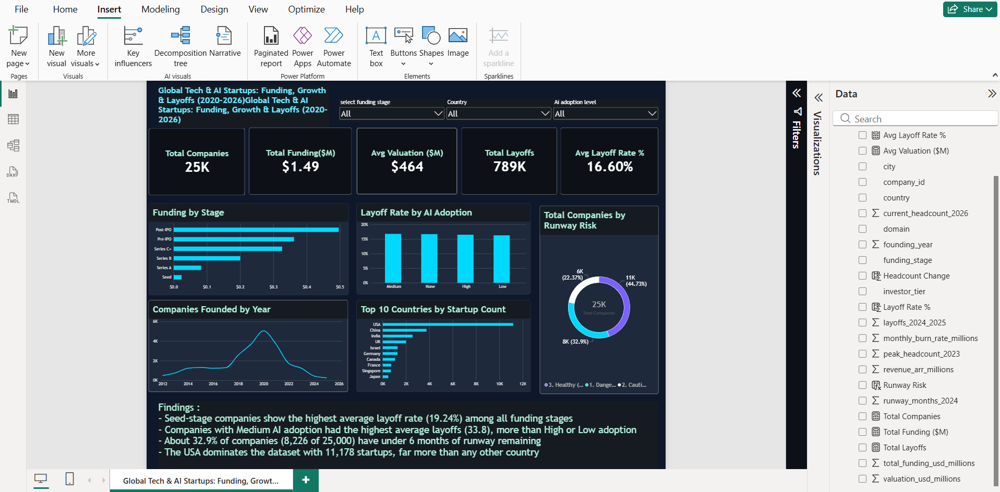

# Global Tech & AI Startups Analysis (2020-2026)

SQL + Power BI analysis of 25,000 startups, examining funding, valuation, AI adoption, and layoffs across the 2020 ZIRP boom, the Generative AI funding surge, and the 2024-2025 Tech Winter.

**Note: its a synthetic dataset**, designed to model realistic patterns from these three macro periods. It is not scraped from real company records, so findings describe patterns in simulated data, not actual company outcomes.

## What's in this repo
- `global_tech_startups_analysis.sql` — database setup, load, validation checks, and 18 business-question queries
- `Startups_Analysis_Documentation.docx` — full write-up: what I did, the synthetic-data caveat, and my findings
- `TechStartups_Theme.json` — the Power BI theme used in the dashboard

## Key findings
- Seed-stage companies show the highest average layoff rate (19.24%) among all funding stages
- Companies with Medium AI adoption had the highest average layoffs (33.8), more than High or Low adoption
- About 32.9% of companies (8,226 of 25,000) have under 6 months of runway remaining
- The USA dominates the dataset with 11,178 startups, far more than any other country

## Tools
Excel/Power Query, MySQL, Power BI

